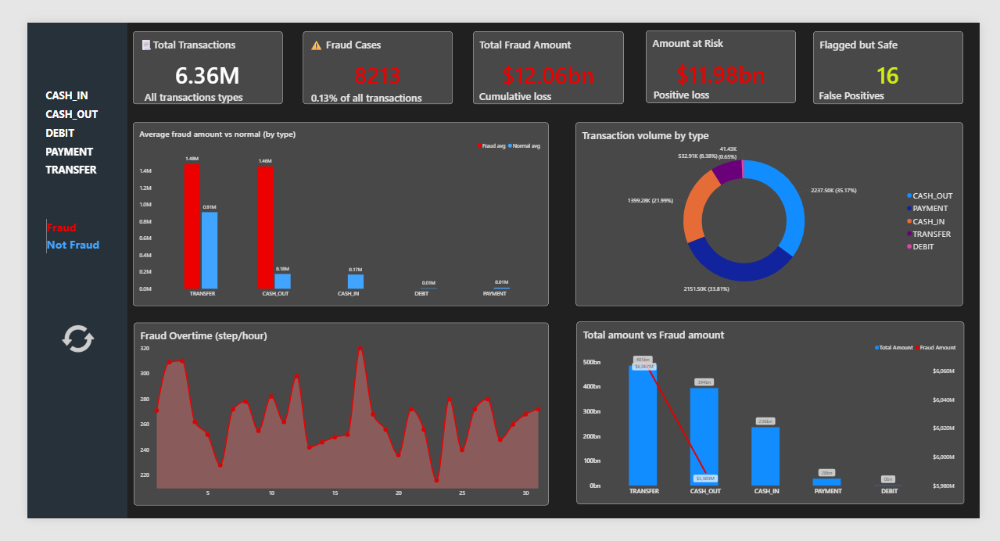

# 🔍 Fraud Detection System

A machine learning project that detects fraudulent financial transactions using Logistic Regression, with an interactive Streamlit web app for real-time predictions.

# Dataset Link :- https://www.kaggle.com/datasets/tarunsaini9785/fraud-detection



---

## 📊 Project Overview

This project analyzes over **6.36 million financial transactions** to identify fraud patterns and builds a predictive pipeline. Key dataset highlights:

- **Total Transactions:** 6.36M across 5 types (CASH_IN, CASH_OUT, DEBIT, PAYMENT, TRANSFER)
- **Fraud Cases:** 8,213 (0.13% of all transactions)
- **Total Fraud Amount:** $12.06 billion
- **False Positives:** Only 16 flagged-but-safe transactions

Fraud is found exclusively in **TRANSFER** and **CASH_OUT** transaction types.

---

## 🗂️ Project Structure

```
├── analysis_model.ipynb          # EDA and model training notebook
├── fraud_detection.py            # Streamlit prediction app
├── fraud_detection_pipeline.pkl  # Saved trained model pipeline
└── AIML Dataset.csv              # Source dataset
```

---

## 🔬 Methodology

### 1. Exploratory Data Analysis (EDA)
- Distribution of transaction types and fraud rates per type
- Transaction amount analysis (log-scale histogram, box plots)
- Balance difference engineering: `balanceDiffOrig` and `balanceDiffDest`
- Fraud pattern over time (step/hour)
- Correlation matrix across numerical features
- Zero-balance-after-transfer analysis as a fraud signal

### 2. Feature Engineering
| Feature | Description |
|---|---|
| `type` | Transaction type (categorical) |
| `amount` | Transaction amount |
| `oldbalanceOrg` | Sender's balance before transaction |
| `newbalanceOrig` | Sender's balance after transaction |
| `oldbalanceDest` | Receiver's balance before transaction |
| `newbalanceDest` | Receiver's balance after transaction |

Dropped columns: `step`, `nameOrig`, `nameDest`, `isFlaggedFraud`

### 3. Model Pipeline
```
Input Features
    └── ColumnTransformer
            ├── StandardScaler       → numerical features
            └── OneHotEncoder        → 'type' column
    └── LogisticRegression
            ├── class_weight = "balanced"   (handles class imbalance)
            └── max_iter = 1000
```

- **Train/Test Split:** 70% / 30% (stratified)
- **Saved with:** `joblib`

---

## 🖥️ Streamlit App

The app (`fraud_detection.py`) lets users enter transaction details and get an instant fraud prediction.

### Running the App

```bash
# Install dependencies
pip install streamlit pandas scikit-learn joblib

# Run the app
streamlit run fraud_detection.py
```

### Input Fields
| Field | Description |
|---|---|
| Transaction Type | PAYMENT, TRANSFER, CASH_OUT, DEPOSIT |
| Amount | Transaction value |
| Old Balance (Sender) | Sender's balance before |
| New Balance (Sender) | Sender's balance after |
| Old Balance (Receiver) | Receiver's balance before |
| New Balance (Receiver) | Receiver's balance after |

### Output
- **`1` → 🚨 Fraud Detected**
- **`0` → ✅ Transaction is Safe**

---

## 📦 Requirements

```txt
pandas
numpy
matplotlib
seaborn
scikit-learn
joblib
streamlit
```

Install all at once:

```bash
pip install pandas numpy matplotlib seaborn scikit-learn joblib streamlit
```

---

## 📈 Key Findings

- Fraud occurs **only** in `TRANSFER` and `CASH_OUT` transactions
- Fraudulent transactions tend to have significantly **higher average amounts** than normal ones
- A strong fraud signal: sender's balance drops to **zero** after the transaction
- Fraud is distributed across all time steps with no single dominant spike

---

## 🚀 Future Improvements

- Try ensemble models (Random Forest, XGBoost) for better recall
- Add SHAP explainability to the Streamlit app
- Deploy the app to Streamlit Cloud or Hugging Face Spaces
- Incorporate real-time transaction streaming

---

## 📄 License

This project is for educational and research purposes.
